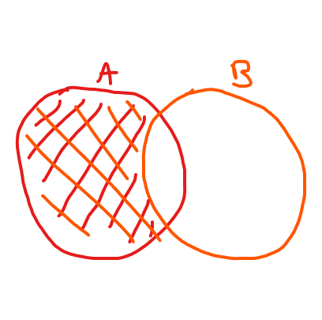
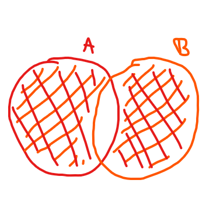

## Verzamelingen
ℕ = Natuurlijke getallen (Enkel positieve gehele getallen -> geen breuken)
Z = Gehele getallen (Positieve en negatieve gehele gettalen -> geen breuken) _update naar correct symbool_
Q = Rationale getallen (Alle gehele getallen en breuken) _update naar correct symbool_
R = Reeële getallen _update naar correct symbool_

Een verzemling is een geheel van objecten die om een gemeenschappelijke reden bij elkaar zitten.
{kat, hond, vis} => (opsomming)
{natuurlijke getallen} => (beschrijving)
Een verzameling bevat enkel unieke objecten, geen duplicaten.
A = {3/4, 6/8, 9/12} = {3/4}

### Verzameling theoretische schrijfwijze

In het met stippels omkaderde stuk vind je dezelfde verzameling opnieuw. Enkel is er hier (blauw omcirkelt) een voorwaarde gegeve aan `a` nog voor de uiteindelijke echte voorwaarden. Dit beschrijft enkel dat deze verzameling zich in (in dit geval) in de reeële getallen bevindt. Je hoeft dit niet te schrijven. Dan wordt er vanuit gegaan dat het over de reeële gettalen gaat. Als je je verzameling tot een andere verzameling wilt beperken, moet je die hier wel aangeven.

### Voorbeeld: schrijvwijzes van gehele veelvouden van 3
= {..., -6, -3, 0, 3, 6, ...}
= {3n | n ∈ Z}
= {q | ∃ n ∈ Z zodat q = 3n}
= {a | a/3 ∈ Z}
= {a ∈ Z | a (mod 3) = 0}

+-----------------------------+
| **Mod - Modulo**            |
| 14 (mod 6) = 2              |
| Hierbij is 2 de rest van 14 |
| bij een deling door 6.      |
+-----------------------------+
+-----------------------------+
| **Symbolen**
| ∀ voor all                  |
| ∃ er bestaat                |
| ∃! er bestaat slechts één   |
+-----------------------------+

### Deelverzameling
A ⊂ B ⇔ ∀ a ∈ A: a ∈ B

### Doorsnede
A ⋂ B = {x | x ∈ A en x ∈ B}
Z ⋂ R^+ = N

### Unie
A ⋃ B = {x | x ∈ A of x ∈ B}

### Verschil
A \ B = {x | x ∈ A en x ∉ B}
B \ A = {x | x ∈ B en x ∉ A}

### Symmetrisch verschil (wordt bijna niet gebruikt)
A ∆ B = {X | x ∈ A: x ∉ B en x ∈ B: x ∉ A} _controleer dit_
A ∆ B = (A \ B) ⋃ (B \ A)
A ∆ B = (A ⋃ B) \ (A ⋂ B)

### Eigenschappen
**Commutativiteit**
A ⊂ B ≠ B ⊂ A
A ⋂ B = B ⋂ A
A ⋃ B = B ⋃ A
A \ B ≠ B \ A
A ∆ B = B ∆ A

**Associativiteit**
(A ⊂ B) ⊂ C ≠ A ⊂ (B ⊂ C)
(A ⋂ B) ⋂ C = A ⋂ (B ⋂ C) = A ⋂ B ⋂ C
(A ⋃ B) ⋃ C = A ⋃ (B ⋃ C) = A ⋃ B ⋃ C
(A \ B) \ C ≠ A \ (B \ C)
(A ∆ B) ∆ C = A ∆ (B ∆ C) = A ∆ B ∆ C

**Distributiviteit**
A ⋂ (B ⋃ C) = (A ⋃ B) ⋂ (A ⋃ C) 
A ⋃ (B ⋂ C) = (A ⋂ B) ⋃ (A ⋂ C)